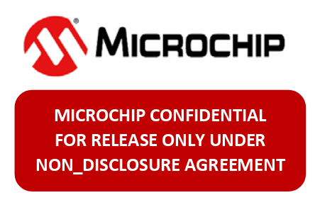

# [atecc608a.github.io](https://atecc608a.github.io/)

## ATECC608A Full (Complete) Datasheet Download

Microchip Technology Inc. (was: Atmel Corporation) had a series of
cool cryptographic chips. They were extremely useful for adding
encryption and authentication to microcontrollers, and they were
probably one of the only chips on the market that came with full
datasheets and specifications without an NDA. Other similar crypto
chips are all behind the closed doors.

It was true for Microchip's [ATECC508A](https://www.microchip.com/wwwproducts/en/ATECC508A)
crypto chips, all datasheets are on the official website, no question is asked.

Unfortunately, for its successor,
[ATECC608A](https://www.microchip.com/wwwproducts/en/ATECC608A),
Microchip refused tocontinue publishing full datasheet as it did in the past. Full
datasheet is only available after signing an NDA. Even worse,
now ATECC508A is *Not Recommended For New Design* anymore,
which means ATECC508A will eventually be discontinued and
completely replaced by the undocumented ATECC608A soon.

#### We need to fix this problem.
### Therefore, we hereby present:
## [ATECC608A Full Datasheet (118 pages).](https://atecc608a.neocities.org/ATECC608A.pdf)

I've signed an NDA, so you don't have to.

Happy hacking, and have a nice day. 

---
The original copy of this website is hosted by Neocities.

# IPFS Mirrors

DMCA takedown? Good luck.

IMPORTANT: While IPFS resources are technically impossible to censor, but all files need
seeders to survive. If you are running a IPFS node, please run the following command to
seed this website.

    $ ipfs pin add -r bafybeig2vahmuslys6pdnipyp6x4l52uybypwpahf2dhzk3y52stnbdy2i

Thanks.

---
Here's a list of IPFS gateways for accessing the IPFS backup of this website.

1. https://ipfs.io/ipfs/bafybeig2vahmuslys6pdnipyp6x4l52uybypwpahf2dhzk3y52stnbdy2i

2. https://cloudflare-ipfs.com/ipfs/bafybeig2vahmuslys6pdnipyp6x4l52uybypwpahf2dhzk3y52stnbdy2i

3. https://ninetailed.ninja/ipfs/bafybeig2vahmuslys6pdnipyp6x4l52uybypwpahf2dhzk3y52stnbdy2i

4. https://ipfs.sloppyta.co/ipfs/bafybeig2vahmuslys6pdnipyp6x4l52uybypwpahf2dhzk3y52stnbdy2i/

5. https://bafybeig2vahmuslys6pdnipyp6x4l52uybypwpahf2dhzk3y52stnbdy2i.cosmos-ink.net/
